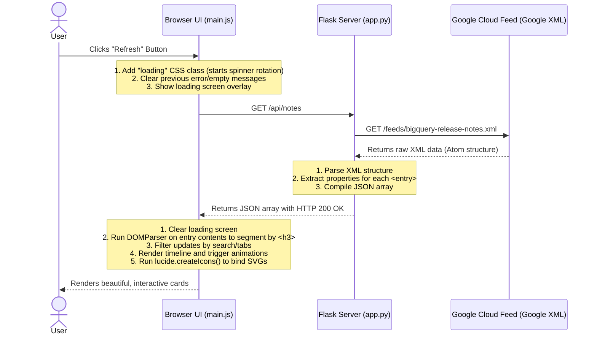

# BigQuery Release Notes Hub: Architecture & Flow Breakdown

This document provides a detailed walkthrough of the codebase, detailing server-side and client-side responsibilities, and traces an end-to-end request/response cycle.

---

## 🌟 Main Features

1. **Live Feed Fetcher**: Connects directly to Google's official BigQuery release notes Atom XML feed, downloads it, and parses it.
2. **Granular Update Segmentation**: Rather than showing entire days as giant blobs, the application breaks down each day's log by heading (`<h3>`) to present individual cards (e.g., separating new features from deprecations on the same day).
3. **Interactive Filter System**: A clean, sidebar-driven navigation bar that lets you filter updates dynamically (e.g., viewing *only* features or *only* changes) without making additional network requests.
4. **Instant Client-Side Search**: A search engine that scans update summaries, categories, and dates instantly as you type.
5. **Multi-Templated Tweet Composer**: A customized editor modal that auto-generates structured tweets from a selected release note in four styles (*Standard*, *Excited*, *Summary*, *Technical*).
6. **Smart Truncation & Preview**: Live mock preview of the social media post. Includes real-time character calculation using an SVG progress ring and ensures the draft stays under the 280-character limit.

---

## 🖥️ Server-Side Architecture (Python Flask)

The server acts as a clean, lightweight proxy and API server. It is housed entirely within [app.py](file:///Users/cerlitomoreno/development/ai/5dgai-vc/agy-cli-projects/bq-releases-notes/app.py).

### Core Components
* **Flask Router**: Serves the homepage (`/`) by rendering the Jinja2 template and exposes the API endpoint (`/api/notes`).
* **HTTP Fetcher (`requests`)**: Calls the Google Cloud endpoint:
  `https://docs.cloud.google.com/feeds/bigquery-release-notes.xml`
  * *Note:* Uses `verify=False` to bypass certificate verification issues common in local Python installations on macOS.
* **XML Parser (`xml.etree.ElementTree`)**: Standard library XML reader configured with the official Atom namespace (`http://www.w3.org/2005/Atom`). It parses the tree and extracts:
  * `<title>` (the publishing date)
  * `<id>` (unique tag ID)
  * `<updated>` (timestamp)
  * `<link rel="alternate">` (direct URL path to Google's release note documentation)
  * `<content>` (the underlying HTML structure of the release note)

### Python Data Payload Schema (`/api/notes`)
The server responds to the client with this structure:
```json
{
  "status": "success",
  "notes": [
    {
      "id": "tag:google.com,2016:bigquery-release-notes#June_22_2026",
      "date": "June 22, 2026",
      "updated": "2026-06-22T00:00:00-07:00",
      "link": "https://docs.cloud.google.com/bigquery/docs/release-notes#June_22_2026",
      "content": "<h3>Feature</h3><p>Metadata transfers from Oracle/MySQL...</p>"
    }
  ]
}
```

---

## 🌐 Client-Side Architecture (HTML5, Vanilla CSS & ES6 JS)

The frontend is built using standard, modern web APIs with zero heavy framework dependencies (e.g. React/Vue). It leverages standard browser elements.

### 1. View Structure ([index.html](file:///Users/cerlitomoreno/development/ai/5dgai-vc/agy-cli-projects/bq-releases-notes/templates/index.html))
Provides semantic markup:
* `<aside>`: Collapsible navigation bar listing feed category filters.
* `<main>`: Live search input, refresh button, metrics indicators (total and features count), and the timeline container.
* `<div id="tweet-modal">`: Overlay dialog incorporating template button grids, textarea inputs, progress gauges, and sharing controls.

### 2. Styling System ([style.css](file:///Users/cerlitomoreno/development/ai/5dgai-vc/agy-cli-projects/bq-releases-notes/static/css/style.css))
* Uses HSL variables (`--bg-main`, `--accent-indigo`, etc.) for dark-mode coloring.
* Implements ambient glowing orbs (`.glow-orb`) using radial-gradient overlays.
* Employs CSS keyframe animations for fade-ins (`fadeIn`), pulser dots (`pulse`), and rotating icons (`rotate`).
* Handles layout responsiveness by collapsing the sidebar into a horizontal navbar on mobile screens.

### 3. Business Logic ([main.js](file:///Users/cerlitomoreno/development/ai/5dgai-vc/agy-cli-projects/bq-releases-notes/static/js/main.js))
* **Feed Parser**: Uses `DOMParser` to read the server's HTML content block, splitting it into separate updates whenever a heading tag (`<h3>`) is found.
* **State Manager**: Controls filtering state (`state.activeFilter`) and searching state (`state.searchQuery`).
* **Lucide Icon Binder**: Executes `lucide.createIcons()` dynamically whenever updates are rendered to build the vector icons.
* **Modal Controller & Text Composer**: Generates preset strings, measures characters, and controls SVG circle progress.

---

## 🔄 End-to-End Request/Response Flow (e.g., Clicking "Refresh")

The sequence below illustrates what happens when you trigger a feed update:



### Detailed Trace: Processing a Specific Update for Tweeting
1. **User interaction**: You click the **Twitter/X** button on a card.
2. **Modal loading**: `openTweetModal(update)` is called:
   * HTML elements are stripped from the update's markup using `stripHtml(content)` (replacing list elements with bullet characters `•`).
   * The tweet generator configures the base text according to the standard style.
3. **Template Calculation**: If the user clicks **Excited**:
   * `setTweetStyle('excited')` runs.
   * Max length calculation: `280 - (excitedIntro.length) - (link.length) - (hashtags.length) - (newlines) = maxBodyLength`.
   * The body is safely truncated: `truncateText(cleanText, maxBodyLength)` (e.g., "This feature is in Preview..." is shortened and appended with `...` if it exceeds the space).
   * The text is updated in the composer, drawing the radial SVG loader ring.
4. **Execution**:
   * **Post on X**: Clicking **Post on X** triggers `window.open` with X's intent URL. The browser opens a secure sharing tab where you can log in and post.
   * **Copy Text**: Clicking **Copy Text** writes the string to your system clipboard using `navigator.clipboard.writeText`, showing a success toast.
