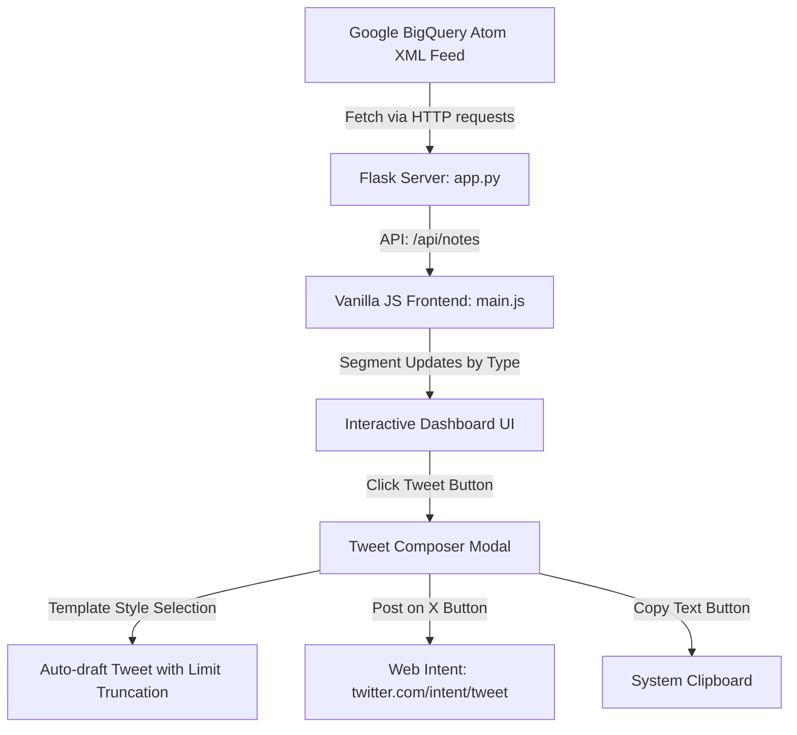

# BigQuery Release Notes Hub

A beautiful, modern, dark-themed web application that fetches the latest **Google BigQuery Release Notes** via their XML Atom feed, processes individual updates, and enables you to customize and tweet about any specific update with a built-in Tweet Composer.

---

## 🛠️ Architecture & Design



### Key Technical Decisions
1. **Flask Backend (`app.py`)**: Fetches the RSS/Atom feed from Google Cloud. Bypasses SSL verification errors (common on macOS local Python instances) and serves a clean JSON API endpoint `/api/notes`.
2. **Client-side Parsing (`main.js`)**: Leverages the browser's native `DOMParser` to parse the Atom feed's raw HTML content. It segments each day's entries into individual update cards grouped by category (Features, Changes, Announcements, Deprecations).
3. **Rich Glassmorphic Design (`style.css`)**: Built with custom HSL CSS variables, custom animations, card lift transitions, radial gradient glowing orbs, and full mobile-responsive breakpoints (collapsing the sidebar navigation into a horizontal tab layout).
4. **Tweet Composer**: Uses Twitter's official Web Intent system (`https://twitter.com/intent/tweet?text=...`) to avoid complex developer API OAuth setup. It includes a real-time character budget counter with an SVG progress ring and dynamically formats the draft based on four pre-made templates (*Standard*, *Excited*, *Summary*, *Technical*).

---

## 📁 Project Directory Structure

Here are the files created for the application:
* [app.py](file:///Users/cerlitomoreno/development/ai/5dgai-vc/agy-cli-projects/bq-releases-notes/app.py) — Flask server code & XML parser.
* [requirements.txt](file:///Users/cerlitomoreno/development/ai/5dgai-vc/agy-cli-projects/bq-releases-notes/requirements.txt) — Dependency list.
* [templates/index.html](file:///Users/cerlitomoreno/development/ai/5dgai-vc/agy-cli-projects/bq-releases-notes/templates/index.html) — HTML template layout.
* [static/css/style.css](file:///Users/cerlitomoreno/development/ai/5dgai-vc/agy-cli-projects/bq-releases-notes/static/css/style.css) — CSS styles, animations, and typography.
* [static/js/main.js](file:///Users/cerlitomoreno/development/ai/5dgai-vc/agy-cli-projects/bq-releases-notes/static/js/main.js) — Feed processing, searching, filtering, and composer logic.

---

## 🚀 How to Run the Application

The application is already running locally in the background on your system. You can open and view it directly:

### 1. View Local Server
Go to: **[http://127.0.0.1:5001](http://127.0.0.1:5001)**

### 2. Manual Execution (If needed in future)
If you close the application and want to restart it:

```bash
# Activate the virtual environment
source .venv/bin/activate

# Start the Flask application
python3 app.py
```

---

## 💡 Key Features of the App

* **Live Refresh**: Click the **Refresh** button at the top-right; it triggers a spinning loader, updates the total statistics, and fetches the latest notes from Google Cloud feeds.
* **Smart Categorization & Filters**: The app automatically classifies updates into *Features*, *Changes*, *Deprecations*, and *Announcements* using the Atom feed headers. You can filter the view using the sidebar tabs.
* **Instant Text Search**: Type anywhere in the search bar to query updates by content, type, or date instantly.
* **Tweet Generator Styles**: Select any update card and click the **Twitter/X** icon to preview drafts in multiple formats:
  * **Standard**: Clean summary format.
  * **Excited**: Boosted launch announcement with emojis (`🚀`, etc.).
  * **Summary/Bullet**: Detailed list representation.
  * **Technical**: Formatted for developers and engineers.
* **Automated Character Truncation**: Ensures your tweet never exceeds X's 280-character limit by trimming the update description dynamically and appending the link/hashtags.
